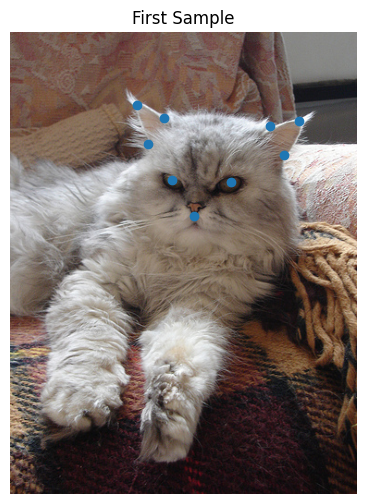
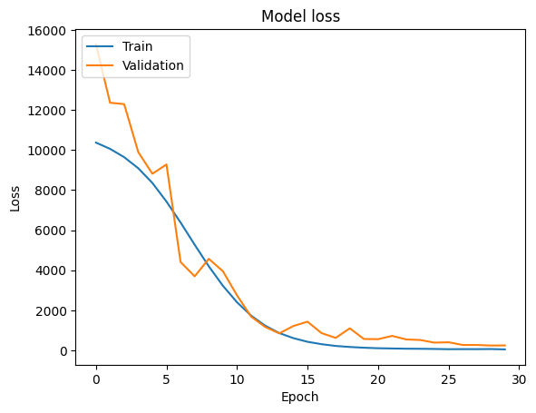

# Cats Feature Points Estimation
Predicting cats feature points using a feature pyramid network

[Kaggle Dataset](https://www.kaggle.com/datasets/crawford/cat-dataset)

## Understanding Data

Each record contains an image and a file with 19 values.

The first value represents the number of points (which is 9)

Each two next values represent a coordinate in the picture which shows a feature point:
* Left Eye
* Right Eye
* Mouth
* Left Ear 1
* Left Ear 2
* Left Ear 3
* Right Ear 1
* Right Ear 2
* Right Ear 3

* 

**Each image has been resized to 224 * 224**

## Modeling
* MobileNetV2 as feature extractor
* Feature pyramid with 4 levels
* Detection head with 18 outputs (each corresponding to a point)

## Evaluation
* 
